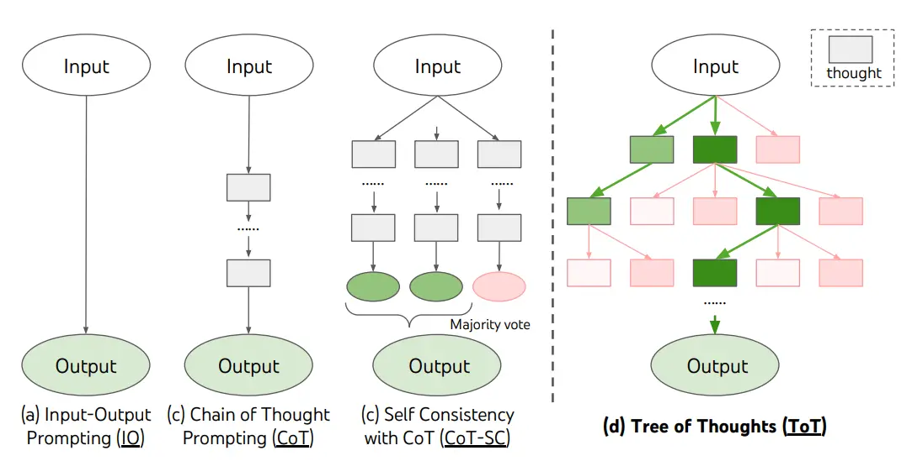
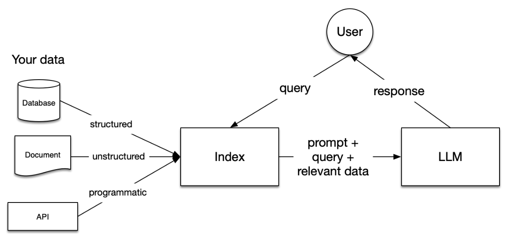
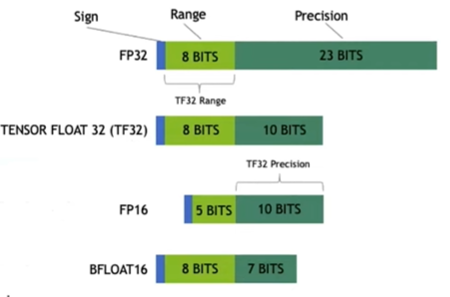

# 大语言模型笔记

## `Transformers`

【`Github` 链接】https://github.com/huggingface/transformers

## `Llama`

`Llama`（`Large Language Model Meta AI`）是由 `Meta`（前 `Facebook`）开发的大型语言模型系列，专为自然语言处理任务设计。`Llama` 主要用于支持生成文本、总结、翻译以及回答问题等应用。

- [`llama-models`](https://github.com/meta-llama/llama-models) ：基础模型的中央存储库，包括基本实用程序、模型卡、许可证和使用政策。
- [`PurpleLlama`](https://github.com/meta-llama/PurpleLlama) ：`Llama Stack` 的关键组成部分，重点关注安全风险和推理时间降低措施。
- [`llama-toolchain`](https://github.com/meta-llama/llama-toolchain) ：模型开发（推理/微调/安全屏蔽/合成数据生成）接口和规范实现。
- [`llama-agentic-system`](https://github.com/meta-llama/llama-agentic-system) ：`E2E` 独立式 `Llama Stack` 系统，以及有主见的底层接口，可创建代理应用程序。
- [`llama-recipes`](https://github.com/meta-llama/llama-recipes) ：社区驱动的脚本和集成。

> 各个版本的产生时期和区别：
>
> ### 1. Llama 1
>
> - **发布日期**：2023 年初
> - **参数规模**：`7B`、`13B`、`30B`、`65B`
> - **开源性**：Llama 1 的开源标志着 Meta 首次向公众提供了强大的开源大语言模型。
> - **架构设计**：Llama 1 使用标准的 Transformer 架构，结合了一些新颖的优化技术，但相对而言模型更为基础。
> - **应用场景**：适用于研究人员和开发者的早期实验性应用。
>
> ### 2. Llama 2
>
> - **发布日期**：2023 年 7 月
> - **参数规模**：继续提供 `7B`、`13B`、`70B` 等版本（`65B` 提升至 `70B`）
> - **优化与性能提升：**
>   - **安全性增强**：Llama 2 专注于优化安全性，加入了额外的内容过滤和安全指南，使得模型在商业应用中更加适用。
>   - **技术改进**：优化了模型的训练和推理性能，加入更多调优，使得模型在各种语言任务中更为稳定。
> - **开源性**：全面开源，且增加了商用许可，使其广泛应用于商业场景。
> - **应用场景**：Llama 2 不仅用于学术研究，还进一步向企业提供了开放资源，支持多种商用案例。
>
> ### 3. Llama 3
>
> - **发布日期**：2024 年（目前最新版本）
> - **参数规模**：扩展至 `8B`、`70B`和 `405B` 的规模，适应不同的计算需求。
> - **架构与技术革新：**
>   - **更优化的层归一化**：采用了 `RMSNorm`，提升训练的稳定性。
>   - **`SwiGLU` 激活函数**：新激活函数带来更高的计算效率。
>   - **`RoPE` 位置编码**：提升了模型在处理长文本时的效果。
> - **多语言与任务支持**：支持超过 30 种语言，并在多语言任务中有更好的表现，适合全球应用。
> - **安全和控制**：引入了 Llama Guard 3 等多语言安全模块，并提供 Prompt Guard 来控制生成内容的安全性，确保模型在高风险应用中的安全。
> - **应用场景**：Llama 3 已能够满足各种高效、精准的 AI 任务，在学术、工业、商业等领域均有广泛应用。
>
> Llama 从 1 到 3 的演进集中在**模型规模的增大、架构的优化和安全性的提升**，每一代都通过技术改进和开放策略不断满足更多场景的需求，使得 Llama 系列在开源大模型中占据主流地位。

## `LoRA`

`LoRA`（`Low Rank Adaption`）是一种参数高效的微调方法（`parameter efficient fine-tuning`，`PEFT`）。

【`HuggingFace` `peft` 库】https://github.com/huggingface/peft

## `Prompt Engineering`

【提示工程指南】https://www.promptingguide.ai/zh

`CoT`（`Chain of Thoughts`）、`ToT`（`Tree of Thoughts`）、`PoT` （`Program of Thoughts`）、`GoT`（`Graph of Thoughts`）

提示工程的范式演化：

- 范式一：手工构造 `prompt`。
- 范式二：使用 `RAG`、`KG` 等手段，对 `prompt` 进行增强。
- 范式三：在 `prompt` 中添加任务示例，即 `few shot learning`。
- 范式四：使用 `CoT` 等方式进行提示。
- 范式五：在 `prompt` 中给出输入、及小模型对该输入得到的输出结果概率分布，让大模型学习和输出结果概率分布。

`Lang Chain`（思维链），是围绕 `LLMs` 构建的框架。该库的核心思想是我们可以将不同的组件 *“ 链 ”* 在一起，以创建更高级的 `LLMs` 用例。链可能由来自几个模块的多个组件组成：

- **`Prompt templates`**：`Prompt templates` 是不同类型提示的模板。例如“ `chatbot` ”样式模板、`ELI5` 问答等。
- **`LLMs`**：像 `GPT-3`、`BLOOM` 等大型语言模型。
- **`Agents`**：`Agents` 使用 `LLMs` 决定应采取的操作。可以使用诸如网络搜索或计算器之类的工具，并将所有工具包装成一个逻辑循环的操作。
- **`Memory`**：短期记忆、长期记忆。

`LCEL`（`LangChain` 表达式）是一种用于构建复杂链条的语言。`LCEL` 使得从基本组件构建复杂链条变得容易，并且支持诸如流式处理、并行处理和日志记录等开箱即用的功能。

## `RAG`

检索增强生成（`Retrieval Augmented Generation`，`RAG`）通过从数据源中检索信息来辅助大语言模型（`Large Language Model`，`LLM`）生成答案。简而言之，`RAG` 结合了搜索技术和大语言模型的提示词功能：即向模型提出问题，并以搜索算法找到的信息作为背景上下文，这些查询和检索到的上下文信息都会被整合进发送给大语言模型的提示中。

## `RLHF`

`RLHF`（`Reinforcement Learning from Human Feedback`，即从人类反馈中进行强化学习）是一种结合了强化学习和人类反馈的方法，用于训练更符合人类期望的模型。`RLHF` 的核心思想是通过人类提供的偏好数据或反馈指导模型的行为，使模型不仅能够完成任务，还能更好地满足用户的需求和期望。

`PPO`（`Proximal Policy Optimization`，即近端策略优化）是一种强化学习算法，由 `OpenAI` 提出，用于解决策略优化问题。`PPO` 在强化学习中被广泛应用，特别是在基于策略梯度（`Policy Gradient`）的方法中，它通过引入“限制步长”的思想来实现高效且稳定的策略更新。

## `Quantilization`

`AMP` 自动混合精度训练，`LLM.int8` 量化。

## `AI Agent`

`AI Agent`（也称人工智能代理）是一种能够感知环境、进行决策和执行动作的智能实体。智能体像人一样，它有记忆、有逻辑分析能力、有任务的拆解能力、问题的拆解能力和最后综合回来统一解决问题的能力。

